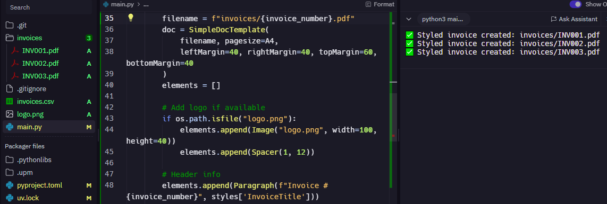

# Invoice PDF Generator

This Python-based tool automatically generates clean, professional PDF invoices from a CSV file using the ReportLab library. Ideal for freelancers and businesses that need to create multiple invoices quickly and consistently.

---

## 📌 Features

- Converts structured invoice data into formatted PDFs
- Adds logo branding automatically (if logo.png is present)
- Professional table layout with automatic calculation of totals
- Outputs one PDF per invoice in the `/invoices/` folder

---

## 🛠️ Technologies Used

- Python 3
- [ReportLab](https://www.reportlab.com/)
- CSV for data input
- Replit (for development)

---

## 🚀 How It Works

1. Prepare an `invoices.csv` file with columns like:
   - invoice_number
   - client_name
   - client_email
   - date
   - item_description
   - quantity
   - unit_price
2. Add a `logo.png` (optional) to brand your invoices.
3. Run the `main.py` script. It:
   - Reads the CSV
   - Groups rows by invoice number
   - Creates a styled PDF invoice for each group
4. PDFs are saved in the `invoices/` folder.

---

## 📸 Screenshot

Invoice Generator Screenshot:

---

## 📄 Sample CSV

You’ll find a sample `invoices.csv` included in the project.

---

## 👤 Author

**Eric M.**  
Python Developer & Web Automation Freelancer  
[View My GitHub Projects](https://github.com/Ek-Coder-Tech)

---

## 📄 License

MIT License

---

## 📬 Contact

For freelance inquiries, please reach out via [Upwork Profile](https://www.upwork.com/freelancers/~012558bab6232e8e65)
